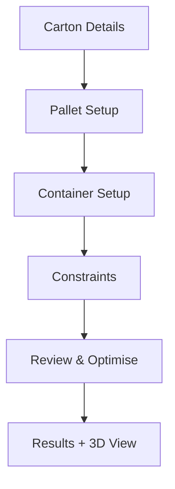

# UI / UX Documentation – Pallet Calculator Application

## Design System Specifications

| Token                | Value (example) | Notes                               |
|----------------------|-----------------|-------------------------------------|
| Primary Colour       | `#2563eb`       | Brand accent used for CTAs          |
| Secondary Colour     | `#0f172a`       | Dark neutral for backgrounds        |
| Success Colour       | `#16a34a`       | Success / validated state           |
| Warning Colour       | `#dc2626`       | Validation errors / destructive     |
| Border Radius        | `0.5rem`        | Consistent rounding across elements |
| Font Family          | Inter, sans-serif | Webfont loaded via Google Fonts   |
| Shadow Elevation 1   | `0 1px 2px rgba(0,0,0,.05)` | Cards & inputs      |
| Grid Unit            | `4px`           | Tailwind uses multiples of 4        |

All tokens map to Tailwind CSS theme extension in `tailwind.config.js`.

## UI Component Guidelines

### Tabs
- Radix `Tabs` primitive with shadcn/ui styling.
- Position fixed at top of main content area underneath the header.
- Use clear, descriptive labels (Carton, Pallet, Container, Constraints, Results).

### Cards / Panels
- Use `shadow` elevation 1, border radius token.
- Padding: `p-6` (24 px) inside.
- Title rendered as `<h2>` with `font-semibold`.

### Input Controls
| Control                         | Library   | Notes |
|---------------------------------|-----------|-------|
| `NumericInputWithSlider`        | custom    | Paired number field + range slider, units select appended |
| `Select` (standard presets)     | shadcn/ui | Use search-enabled variant for large lists |
| `Switch` (boolean toggles)      | shadcn/ui | Display outline when focused for accessibility |

Validation messages appear beneath the control using `text-warning` colour.

### Buttons
- Primary action: `.btn-primary` (blue background, white text) → Tailwind `bg-primary text-white hover:bg-primary/90`.
- Secondary action: outlined style.
- Destructive: red variant.
- Minimum tap target: 44 × 44 px.

### 3D Visualisation Canvas
- Utilise full width of container on desktop, collapses to 100 % viewport width on mobile.
- Provide `OrbitControls` for rotate / zoom.
- Overlay semi-transparent legends (cube utilisation %, pallets used).

## User Experience Flow Diagrams

## Responsive Design Requirements
- Mobile first: breakpoints at `sm` 640 px, `md` 768 px, `lg` 1024 px.
- Cards stack vertically on `sm`, two-column grid on `lg`.
- Canvas height clamps to 220 px on phones, 480 px on desktop.

## Accessibility Standards
- **WCAG 2.1 AA** compliance.
- All interactive components must be keyboard navigable.
- Provide `aria-label` / `aria-describedby` on custom inputs.
- Colour contrast ratio ≥ 4.5:1 for text.
- Focus outline must be visible (`outline-primary`).

## Style Guide & Branding
- Logo top-left linking to home.
- Use primary blue for brand; avoid over-use.
- Typography scale (Tailwind): `text-base` body, `text-xl` section headings, `text-3xl` page title.

## Component Library Organisation
- Store shared primitives in `src/components/ui/` (generated via shadcn CLI).
- Feature-specific components live under `src/components/featureName/` as project grows.

## User Journey Maps
1. **New Optimisation**
   1. Select units → 2. Fill carton details → 3. Configure pallet/container → 4. Define constraints → 5. Run optimisation → 6. Explore results → 7. Export.
2. **Change Units mid-flow**
   1. Toggle units → 2. Values auto-convert → 3. User verifies inputs → 4. Re-optimise.

## Wireframe References
Basic wireframes are stored in Figma file `Pallet-Calculator-UI.fig`, linked in project Slack (#design). Screens: Home, Carton Form, Results.

## Design Tool Integration
- Figma for mock-ups & components. Provide exported SVG icons under `public/assets/icons/`.
- Use `figma-tokens` plugin to synchronise design tokens with Tailwind config.
